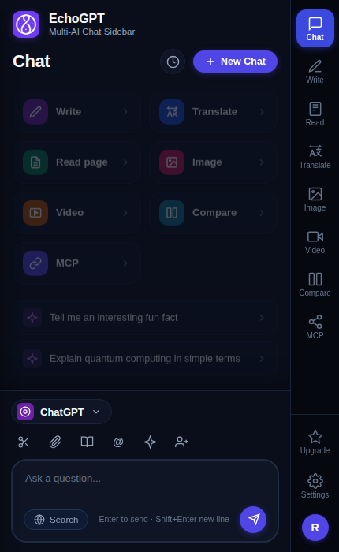
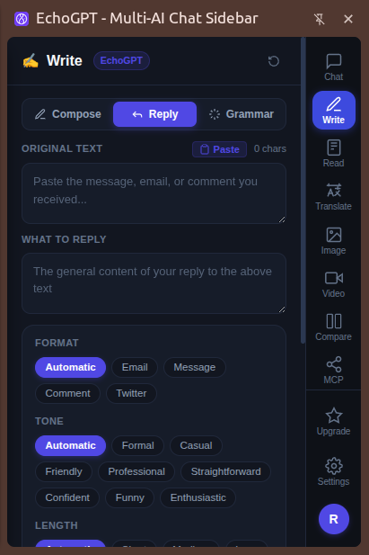

# EchoGPT - Multi-AI Chat Sidebar 🚀

<div align="center">


### *Your Universal AI Copilot for Chrome — Chat, Write, Read, Translate & Compare in One Persistent Sidebar*

[](#installation--setup)
[](#-supported-ai-models)
[](#-interface-overview)
[](#-license)

</div>

---

## 📖 Overview

**EchoGPT** is an all-in-one browser companion built natively with **Chrome Manifest V3's Side Panel API**. Designed to eliminate context switching, EchoGPT lives quietly beside your active web pages without cluttering the screen or relying on intrusive floating iframes.

Seamlessly swap between world-class models like **GPT-4o**, **Claude 3.5 Sonnet**, **Gemini 1.5 Pro**, and **Local Ollama** (100% private & offline) — or use the built-in **EchoGPT Turbo** engine for instant web summaries, professional copywriting, smart replies, live translations, and side-by-side model benchmarking.

---

## 📸 Screenshots

<div align="center">
  <table>
    <tr>
      <td align="center" width="50%">
        <strong>💬 Multi-AI Chat Workspace</strong><br><br>
        
      </td>
      <td align="center" width="50%">
        <strong>✍️ Smart AI Writer & Reply Studio</strong><br><br>
        
      </td>
    </tr>
    <tr>
      <td align="center"><em>Interactive chat with model switcher, action cards, dock tools, and live web search</em></td>
      <td align="center"><em>Compose, Reply, and Grammar modes with tone, format, and length controls</em></td>
    </tr>
  </table>
</div>

---

## ✨ Key Features

### 1. 💬 Multi-AI Chat Sidebar
* **Fast Model Switching**: Instantly switch between OpenAI, Anthropic, Google Gemini, and local Ollama models on the fly.
* **🌐 Real-Time Web Search**: Toggle live web search mode to cite up-to-date sources and news directly into responses.
* **Dock Utility Tools**:
  * ✂️ **Snippets**: Save and insert reusable prompt templates.
  * 📎 **File Attachment**: Attach documents or images to your prompts.
  * 📖 **Prompt Library**: Curated system prompts for productivity, coding, and marketing.
  * `@` **Context Mention**: Pull `@page` metadata or `@tab` contents straight into the prompt.
  * ✨ **Magic Enhancer**: One-click AI prompt refiner to turn basic questions into detailed instructions.
  * 👥 **AI Agent Mode**: Multi-step collaborative assistant workflow.
* **Slash Commands**: Quick shortcuts like `/summary`, `/bullets`, `/explain`, `/code`, and `/translate`.
* **Chat History**: Fully searchable conversation history drawer with persistent local storage.

### 2. ✍️ Advanced AI Writer (`Write` Studio)
* **Three Dedicated Modes**:
  * 📝 **Compose**: Generate blog posts, articles, emails, idea lists, or outlines from a topic.
  * ↩️ **Reply**: Paste received emails, comments, or customer messages, provide brief notes on your intent, and generate perfectly tailored replies.
  * 🪄 **Grammar**: One-click proofreading, syntax fixes, vocabulary enhancement, and tone smoothing.
* **Granular Controls**:
  * **Formats**: `Automatic`, `Email`, `Message`, `Comment`, `Twitter / X`, `Paragraph`, `Outline`.
  * **Tones**: `Automatic`, `Formal`, `Casual`, `Friendly`, `Professional`, `Straightforward`, `Confident`, `Funny`, `Enthusiastic`.
  * **Lengths**: `Automatic`, `Short`, `Medium`, `Long`.
  * **Language Selector**: Draft content in English, German, Spanish, French, Japanese, and more.
* **Instant Refinement Tools**: Refine existing drafts with 1-click actions: *Make Shorter*, *Expand*, *More Professional*, or *Change Tone*.

### 3. 📄 Web Page Reader (`Read`)
* **DOM Cleanup Engine**: Automatically strips navigation banners, scripts, ads, and footers to extract clean core article text.
* **Word & Token Counter**: Real-time word count and estimated token usage for the active tab.
* **Executive Summaries**: One-click generation of concise summaries, key takeaways, and action items.

### 4. 🌐 Real-Time Translator (`Translate`)
* Bi-directional translator supporting Auto-Detect, English, Spanish, French, German, Chinese, and Japanese.
* One-click clipboard copy for quick messaging.

### 5. 🖼️ AI Image Generator (`Image`)
* Generate images with tailored style presets: `Photorealistic`, `Digital Art`, `Anime`, and `Minimalist`.

### 6. 🎬 Video Insights (`Video`)
* Ingest active video tabs or YouTube links to extract chapter timestamps, key topics, and core summaries.

### 7. ⚖️ Dual-AI Model Arena (`Compare`)
* Run the exact same prompt simultaneously through two distinct LLMs side-by-side (e.g., EchoGPT Turbo vs Claude 3.5 Sonnet) to compare reasoning depth, response speed, and formatting.

### 8. 🔗 Model Context Protocol (`MCP`)
* Modular tool integration for browser automation, filesystem access, and data analysis kits.

### 9. 🖱️ Context Menu Integration
* Highlight any text on any webpage and right-click to:
  * *Ask EchoGPT about selection*
  * *Summarize this page with EchoGPT*
  * *Translate selection with EchoGPT*

---

## 🤖 Supported AI Models

| Model | Provider | Context Window | Best For | Special Tags |
| :--- | :--- | :---: | :--- | :--- |
| **EchoGPT Turbo** | Echo AI | 128k | Everyday browsing, fast summaries, instant tasks | ⚡ Ultra Fast, 🌐 Web Ready |
| **ChatGPT (GPT-4o)** | OpenAI | 128k | Multimodal tasks, complex math, structured JSON | 👁️ Vision, 🛠️ Tool Use |
| **Claude 3.5 Sonnet** | Anthropic | 200k | Software architecture, coding, natural prose | 💻 Code Master, 🧠 Deep Logic |
| **Gemini 1.5 Pro** | Google | 1M+ | Large documents, code repositories, deep context | 📚 1M Context, 🔬 Multimodal |
| **Ollama (Llama 3)** | Self-Hosted | 32k | Offline work, confidential data, zero telemetry | 🔒 100% Private, 🆓 Free |

---

## ⌨️ Keyboard Shortcuts

| Shortcut | Action |
| :--- | :--- |
| <kbd>Ctrl</kbd> + <kbd>Shift</kbd> + <kbd>E</kbd> *(Windows/Linux)* | Open / Toggle EchoGPT Extension |
| <kbd>Cmd</kbd> + <kbd>Shift</kbd> + <kbd>E</kbd> *(macOS)* | Open / Toggle EchoGPT Extension |
| <kbd>Enter</kbd> | Send message in chat |
| <kbd>Shift</kbd> + <kbd>Enter</kbd> | Add new line in prompt box |
| <kbd>Alt</kbd> + <kbd>1</kbd> | Switch to **Chat** view |
| <kbd>Alt</kbd> + <kbd>2</kbd> | Switch to **Write** studio |
| <kbd>Alt</kbd> + <kbd>3</kbd> | Switch to **Read page** view |
| <kbd>Alt</kbd> + <kbd>4</kbd> | Switch to **Translate** view |
| <kbd>Alt</kbd> + <kbd>5</kbd> | Switch to **Image** generator |
| <kbd>Alt</kbd> + <kbd>6</kbd> | Switch to **Video** insights |
| <kbd>Alt</kbd> + <kbd>7</kbd> | Switch to **Compare** arena |
| <kbd>Alt</kbd> + <kbd>8</kbd> | Switch to **MCP** tools |

---

## 🚀 Installation & Setup

### Load Unpacked in Chrome (Developer Mode)

1. **Clone or Download** this repository:
   ```bash
   git clone https://github.com/your-username/echogpt-extension.git
   ```
2. Open Google Chrome and navigate to:
   ```text
   chrome://extensions/
   ```
3. Enable **Developer mode** using the toggle switch in the top-right corner.
4. Click the **Load unpacked** button in the top-left corner.
5. Select the `EchoGPT extension` project folder.
6. Click the extension icon in your Chrome toolbar or press <kbd>Ctrl</kbd> + <kbd>Shift</kbd> + <kbd>E</kbd> (<kbd>Cmd</kbd> + <kbd>Shift</kbd> + <kbd>E</kbd> on macOS) to open the side panel!

---

## ⚙️ Configuration & API Keys (BYOK)

EchoGPT works out of the box with realistic streaming simulation. To connect directly to real AI endpoints:

1. Open EchoGPT and click **Settings** (⚙️) on the bottom of the navigation rail.
2. Under **API Keys (BYOK - Optional)**, enter your keys:
   * **OpenAI API Key**: `sk-...`
   * **Anthropic API Key**: `sk-ant-...`
   * **Google Gemini API Key**: `AIzaSy...`
   * **Ollama Host URL**: Default `http://localhost:11434`
3. Click **Save Preferences**. Keys are stored securely in your browser's private `chrome.storage.local`.

---

## 🔒 Privacy & Permissions

EchoGPT operates with strict privacy standards:
* **`sidePanel`**: Renders the persistent assistant sidebar.
* **`activeTab` & `scripting`**: Only reads text on the currently active tab when you explicitly trigger "Read Page" or context menu actions.
* **`storage`**: Saves your themes, conversation history, and API keys locally on your device.
* **`contextMenus`**: Adds convenient right-click shortcuts for selections.
* **Zero External Telemetry**: Your browsing history is never tracked or shared.

---

## 🤝 Contributing

Contributions, feature requests, and bug reports are welcome!
1. Fork the Project.
2. Create your Feature Branch (`git checkout -b feature/AmazingFeature`).
3. Commit your Changes (`git commit -m 'Add some AmazingFeature'`).
4. Push to the Branch (`git push origin feature/AmazingFeature`).
5. Open a Pull Request.

---

## 📄 License

Distributed under the **MIT License**. See `LICENSE` for more information.
